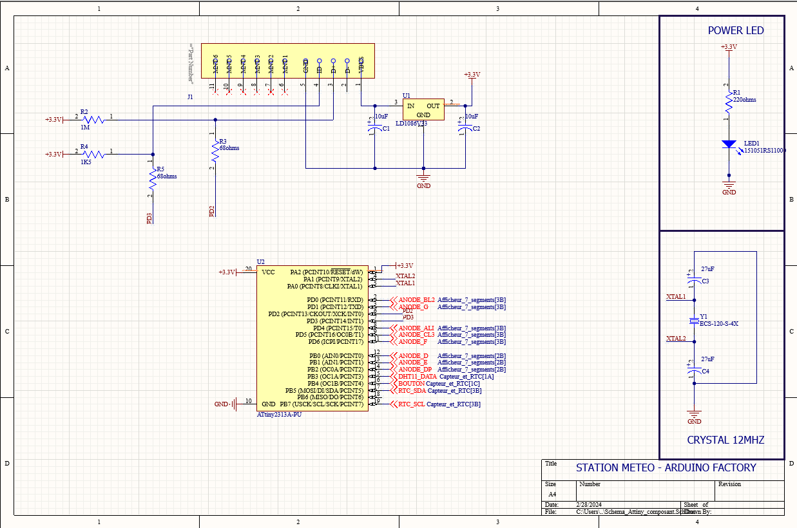
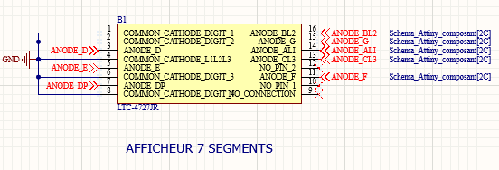
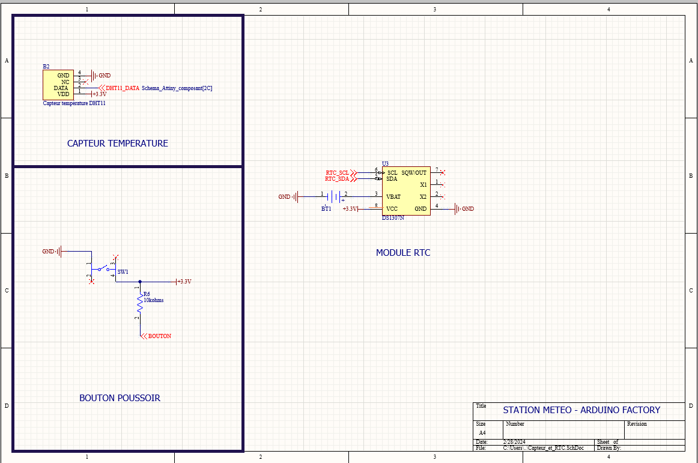
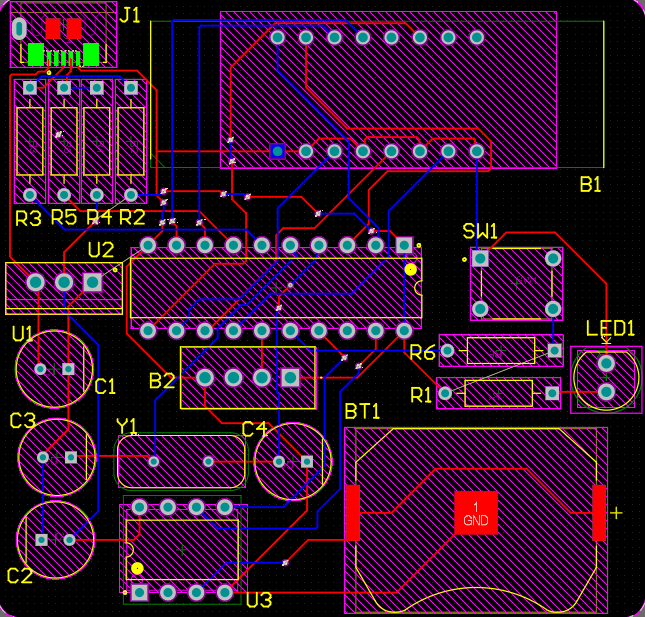
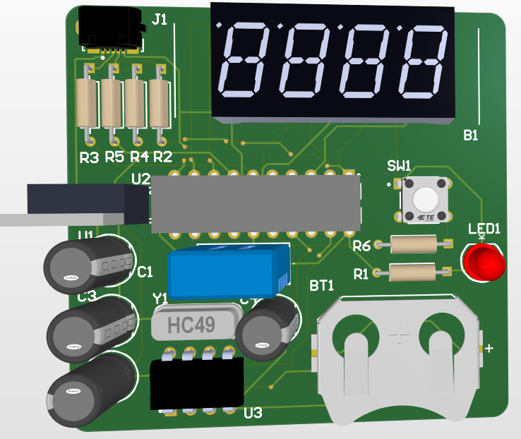

# Weather-Station-PCB-board

We've realized a portable weather station based on an ATtiny card. The aim is to be able to read the temperature and humidity associated with the time of day.

ATtiny is a family of microcontrollers manufactured by Microchip Technology. These small electronic components are renowned for their compact size, low power consumption and reliable performance, making them ideal for a variety of embedded applications.

*Project duration: 3 days*

# Table of contents
- [Electronic diagram](#electronic-diagram)
- [PCB Design](#pcb-design)
  

## Electronic diagram

Our weather station uses an ATtiny 2313A, which can be programmed on Arduino ide. We then added a micro-usb connector to make it easier to program and power the board. We also added a power LED and a quartz crystal to clock the ATtiny. 

 

We've added a DHT11 temperature sensor that acquires both temperature and humidity. It operates as a digital signal, which is not the case for all temperature sensors like the TMP36.

For the push-button, we added a pull-down resistor so that it's in the low state when not pressed. 

We then added an RTC module to keep the correct time even when our board is not powered:

 

We have a 7-segment 4-digit display for time, temperature and humidity : 

 

## PCB Design

The PCB consists of two layers, Top Layer and Bottom Layer. We've added a micro-usb connector to the top left of the PCB so that we can power the board and program the ATtiny from Arduino IDE.

We've added a 7-segment display to read the time, temperature and humidity.

The middle of the PCB shows the ATtiny 2313A in gray. In blue we have the DHT11 sensor. Finally, at the bottom of the board is the DS1307 with a button cell to power it:

Here's the top layer view of the PCB:

 

Here is a 3d view of the PCB:

 

## Arduino Factory

 * [More details on this project](https://arduinofactory.fr/carte-pcb-pic16f/)
  

